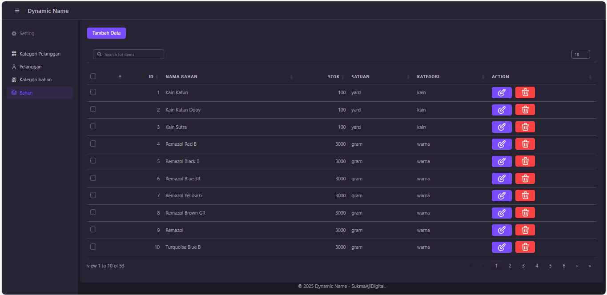

## About app



## Installation
- clone https://github.com/sukmaajidigital/dashboardumkm.git

- Install project with composer & npm
```bash
  composer install
  npm install
```
- copy .env.example to .env
```bash
  copy .env.example .env #on windows
  cp .env.example .env #on linux
```
- migrate database
```bash
  php artisan migrate --seed
  #type yes if there is no database yet
```
- run dependencies
```bash
  npm run Build
  php artisan serve
```
## License

The Laravel framework is open-sourced software licensed under the [MIT license](https://opensource.org/licenses/MIT).

## Laravel
<p align="center"><a href="https://laravel.com" target="_blank"></a></p>

<p align="center">
<a href="https://github.com/laravel/framework/actions"></a>
<a href="https://packagist.org/packages/laravel/framework"></a>
<a href="https://packagist.org/packages/laravel/framework"></a>
<a href="https://packagist.org/packages/laravel/framework"></a>
</p>
